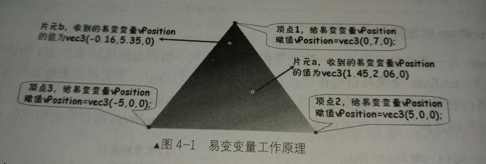

第二章 着色语言
====
## 1. 着色言概述
> OpenGL ES 着色语言是一种高级的图形编程语言，其源自广泛应用的C语言、同时具有RenderMan以及其它着色语言的一些优良特性，易于被开发人员掌握。

>与传统通用的编程语言有很大不同的是，其提供了更加丰富的原生类型，如向量、矩阵等，这些新特性的加入使得OpenGL ES 着色语言在处理3D图形方面更加高效、易用。简单来说,OpenGL ES 着色语言主要包括以下特性.
+ OpenGL ES 着色语言是一种的过程性语言（注意:不是面向对象）
+ 对定点着色器、片元着色器使用的是同样的语言，不做区分
+ 基于c/c++的语法及流程控制
+ 完美支持向量与矩阵的各种操作
+ 通过类型限定符来管理输入与输出
+ 拥有大量的内置函数来提供丰富的功能

总之,OpenGL ES 着色语言是一种易于实现、功能强大、便于使用、完美支持硬件灵活性，并且可以高度并行处理、性能优良的高级图形编程语言。其可以帮助开发人员在不浪费大量的时间的情况下，轻松地为用户带来更加完美的视觉体验，开发出更加酷炫的3D场景与特效。

对于3D游戏开发人员来说，掌握这门语言尤为重要。本章的后继美容将从多个方面介绍OpenGL ES 着色语言的基本知识，使得读者初步了解着色语言，为以后深入地学习打下坚实的基础.

## 2. 着色语言基础
OpenGL ES 着色语言虽然是基于c/c++语法的语言，但是其余c/c++ 相比较还是有很大不同的。例如，该语言不支持双精度浮点型(double)、字节型(byte)、短整型(short)、长整型（long），并且取消了C语言中的联合体（union）、枚举类型（enum）、无符号整型（unsigned）以及位运算等特性。

### 2.1 数据类型概述
与C语言类似，着色语言中有许多内建的原生数据类型，如浮点型(float)、布尔类型(bool)、整型(int)、矩阵型(matrix)以及向量类型(vec2,vec3等)等。总体来说，这些数据可以分为标量、向量、矩阵、采样器、结构体以及数组等几类。
#### 2.1.1 标量
标量也被称为“无向量” ，其值只具有大小，并不具有方向。标量之间的运算遵循简单的代数法则，如质量、密度、体积、时间以及温度等都属于标量。OpenGL ES 着色语言支持的标量类型有bool、int、float,各自的用法如下所列。
* 布尔型----bool<br><br>
`布尔型用来声明一个单独的布尔数，其值只能为true与false中的一个，bool类型的值一般由关系运算或者逻辑运算产生，在着色语言的流程控制中只能使用布尔类型的值作为表达式，其基本用法如下所示:`
```C
bool b;//声明一个布尔类型的变量
```
* 整型----int<br><br>
`整型用来声明一个单独的整数，其值可以为正数，负数及0。与c语言的整型有所不同，在OpenGL ES 着色语言中的整数保证最少支持16位精度。开发时注意运算需要在正确的范围内进行(若16位精度范围为[-65535~65536],着色语言中所谓的精度不含符号位)，超出运算范围可能产生溢出问题.`<br><br>
`OpenGL ES着色语言中整数也可以像C语言中一样，用十进制、八进制、或者十六进制等不同的进制表示，基本用法如下所示:`
  ```C
  int a=15;//十进制
  int b=036;//0开头的字面常量为八进制，代表十进制的30
  int c=0x3D;//0x开头的字面常量为十六进制，代表十进制的58
  ```
* 浮点型---float<br><br>
`浮点型用来声明一个单独的浮点数、基本用法如下所示。`
```C
  float f;//声明一个float型的变量
  float g=2.0;//在声明变量的同时为变量赋值
  float h,i;//同时声明多个变量
  float j,k=2.561;//声明多个变量时，可以为其中某些变量赋初值
```
 需要注意的是，由于OpenGL ES着色语言中没有像C/C++语言一样提供多种不同精度的整数与浮点数，因此代码中字面常量就不需要使用后缀来说明精度了，只要给出值即可。

#### 2.1.2 向量
OpenGL ES着色语言中，向量可以看做是用同样类型的标量组成的，其基本类型也分为bool、int、float 3种。每个向量就可以由2个、3个或者4个相同的标量组成,具体情况如下

|向量类型|说明|向量类型|说明|
|-|-|-|-|
|vec2|包含了2个浮点数的向量|ivec4|包含了4个整数的向量|
|vec3|包含了3个浮点数的向量|bvec2|包含了2个布尔数的向量|
|vec4|包含了4个浮点数的向量|bvec3|包含了3个布尔数的向量|
|ivec2|包含了2个整数的向量|bvec4|包含了4个布尔数的向量|
|ivec3|包含了3个整数的向量| | | |
+ 声明向量类型的基本语法如下.
```C
vec2 v2;//声明一个vec2类型的向量
ivec3 v3;//声明一个ivec3类型的向量
vec4 v4;//声明一个bvec4类型的向量  
```
+ 向量在着色器代码中开发中有着十分重要的作用，可以很方便地存储以及操作颜色、位置、纹理坐标等不仅包含一个组成部分的量。开发中，有时也可能需要单独访问想向量中的某个分量买几本的语法为"<向量名>.<分量名>"，根据目的的不同，主要有以下几种用法。<br><br>
+ 将一个向量看做颜色是，可以使用r、g、b、a 4个分量名，其分别代表红、绿、蓝、透明度4个色彩通道，具体用法如下。
```C
aColor.r=0.6;//给向量aColor的红色通道分量赋值
aColor.g=0.8;//给向量aColor绿色通道分量赋值
```
`若向量是4维的，则可以使用的分量名为:r、g、b、a；若向量是3维的，则可以使用的分量名为r、g、b；若为2维的，则可以使用r、g。`

+ 将一个向量看做位置时，可以使用x、y、z、w等四个分量名，其分表代表X轴、Y轴、Z轴、向量的4个分量，具体用法如下。<br>
```C
aPosition.x=67.2;//给向量aPosition的X轴分量赋值
aPosition.z=48.3;//给向量aPosition的z轴分量赋值
```
`若向量是4维的，则可以使用的分量名为:x、y、z、w；若向量是3维的，则可以使用的分量名为x、y、z；若为2维的，则可以使用x、y。`

+ 将一个向量看做纹理坐标时，可以使用s、t、p、q等4个分量名，其分别代表纹理坐标的不同分量，具体用法如下。<br>
```C
aTexCoor.s=0.65;//给向量aTexCoor的s分量赋值
aTexCoor.t=0.34;//给向量aTexCoor的t分量赋值
```
`若向量是4维的，则可以使用的分量名为:s、t、p、q；若向量是3维的，则可以使用的分量名为s、t、p；若为2维的，则可以使用s、t。`
+ 访问向量中的各个分量不但可以采用“.”加上不同的分量名，还可以将向量看做一个数组，用下标来进行访问，具体用法如下.
```C
aColor[0]=0.6;//给向量aColor红色通道分量赋值
aPosition[2]=48.3;//给向量aPosition的z轴分量赋值
aTexCoor[1]=0.34;//给向量aTexCoor的t分量赋值
```

#### 2.1.3 矩阵
有一些基础的开发人员都知道，3D场景中的移位，旋转，缩放等变换都是由矩阵的运算都实现的。因此3D场景的开发中会非常多地使用到矩阵，因此OpenGL ES着色语言中也提供了对矩阵类型的支持。这大大方便了开发，免去了自行构建矩阵的麻烦.

+ 矩阵按尺寸分为2x2矩阵，3x3矩阵以及4x4矩阵，具体情况如下表所列:

|矩阵类型|说明|
|---|---|
|mat2|2x2的浮点数矩阵|
|mat3|3x3的浮点数矩阵|
|mat4|4x4的浮点数矩阵|
+ 矩阵类型的基本用法如下.
  ```C
  mat2 m2;//声明一个mat2类型的矩阵
  mat3 m3;//声明一个mat3类型的矩阵
  mat4 m4;//声明一个mat4类型的矩阵
  ```
OpenGL ES 着色语言中，矩阵是按列顺序组织的.
也就是一个矩阵可以看做由几个列向量组成。
例如:mat3就可以看作由3个vec3组成


#### 2.1.4 采样器
采样器是着色语言中不同于C语言的一种特殊的基本数据类型，其专门用来进行纹理采样的相关操作。一般情况下，一个采样器变量代表一副或一套纹理贴图，其具体情况如下表所列

|采样器类型|说明|采样器类型|说明|
|-|-|-|-|
|sampler2d|用于访问二维纹理|sampleCube|用于访问立体贴图纹理|
|sampler3d|用于访问三维纹理| | | |

`需要注意的是，采样器变量不能在着色器中初始化。一般情况下采样器变量都用uniform限定符修饰，从宿主语言(如:java)接收传递进着色器的值`<br><br>
`sampler3d并不是在所有的OpenGL ES实现中都支持，因此，若要使用必须首先
  着色器代码中进行设置，打开相应的扩展.`

#### 2.1.5 结构体
+ `OpenGL ES 着色语言还提供了类似于C语言中的用户自定义结构体，同样是使用struct关键字进行声明，基本用法如下所示.`
  ```C
  struct info {//声明一个结构体info
    vec3 color;//颜色成员
    vec3 position;//位置成员
    vec2 textureCoor;//纹理坐标成员
  }
  ```
+ 声明了info类型的结构体之后，就可以像使用内建数据类型一样使用这个用户自定义的类型了，如:<br>
```C
info CubeInfo;//声明了一个info类型的变量CubeInfo
```  

#### 2.1.6 数组
声明数组的方式主要有两种，具体如下所列:
+ 在声明数组的同时，指定数组的大小
  ```C
  vec3 position[20];//声明了一个包含20个vec3的数组，索引从0开始
  ```
+ 在声明数组时，也可以不指定数组的大小，但是必须符合下列相中情况之一.<br><br>
(1). 引用数组之前，要再次使用第一种声明方式来声明该数组，代码如下.
```C
vec3 position[];//声明了一个大小不定的vec3数组
vec3 position[5];//再次声明该数组，并且指定大小
```
`再次声明数组，指定大小之后，就不能再进行声明了`<br><br>
(2). 代码中访问数组的下标都是编译时常量（如:字面常量），这时编译器就会自动创建适当大小的数组，使得数组尺寸足够存储编译器看到的最大索引值对应的元素，代码如下:
```C
vec3 position[];//声明了一个大小不定的vec3型数组
position[3]=vec3(3.0);//position需要一个大小为4的数组
position[20]=vec3(6.0);//position需要一个大小为21的数组
```
`上述代码中的第2行需要尺寸为4的数组，代码的地3行需要尺寸为21的数组，若后面没有更大的下标出现，则编译器自动创建position为尺寸为21的数组。这种由系统量体裁衣，自动分配的方法若恰当使用可以提高硬件的使用效率，降低对硬件资源的消耗。`

#### 2.1.7 空类型
空类型使用void表示，仅用来声明不返回任何值的函数。例如在顶点着色器以及片元着色器中必须存在的main函数就是一个返回值为空类型的函数，代码如下所示.
  ```C
  void main() {

  //函数的具体操作省略...
  }
  ```

### 2.2 数据类型的基本使用
前一小节介绍了OpenGL ES着色语言中的各个数据类型，掌握了这些数据类型的基本知识后，本节将简单地介绍这些数据类型的声明，初始化以及作用域.<br><br>
1. 声明、作用域及初始化<br>
`变量的声明及作用域与C++语法类似，可以在任何需要的位置声明变量，同时其作用域也与C++类似，分为局部变量与全局变量。请读者考察如下代码片段。`
```C
int a,b;//声明了全局变量a及b
vec3 aPosition=vec3(1.0,2.0,3.3);//声明了全局变量aPosition并赋初值
void myFunction(){
      int c=14;//声明了局部变量C并赋初值
      a=4;//给全局变量a赋值
      b=a*c;//给全局变量b赋值
}
```
`着色语言还有一点特殊的地方，在一些着色语言的实现中不可以在if语句中声明新的变量，这是为了简化变量在else子句上的作用域的实现。目前的Android平台的各种实现基本都是在支持在if语句中声明变量的，但也不排除有特殊的情况出现，了解这一点即可。`<br><br>
`虽然着色器中变量的命名很自由，仅要求变量由字母，数字与下划线组成，且必须以字母或者下划线开头。但开发人员在开发程序时，有一个良好的命名习惯将大大提高代码的可维护性，同时使得开发的代码简介、美观、可读性强。因此，建议在OpenGL ES着色语言中，变量按照如下规则命名.`<br><br>
 + 由于系统中有很多内建变量都是以“gl_”作为开头，因此用户自定义的变量不允许使用“gl_”作为开头.
 + 为自己的函数或变量取名时尽量采用有意义的拼写，除了一些局部变量外不要采用a、b、c这样的名称。若一个单词不足以描述变量的用途，可以用单个单词的组合，除第一个单词全小写外，其他每个单词的第一个字母大写.

 + `向量的初始化还有一些灵活变化的技巧，下面的代码片段说明了这个问题.`
```C
float a=12.3;//声明了浮点变量a并赋初值
float b=11.4;//声明了 浮点变量b并赋初值
vec2 va=vec2(2.3,2.5);//声明了2维向量va并赋初值
vec2 vb=vec2(a,b);//声明了2维向量vb并赋初值
vec3 vc=vec3(vb.13.5);//声明了3维向量vc并赋初值
vec4 vd=vec4(va,vb);//声明了4维向量vd并赋初值
vec4 ve=vec4(0.2);//声明了4维向量ve并赋初值，相当于vec4(0.2,0.2,0.2,0.2)
```
从上诉代码中可以看出，初始化时向向量的各个分量既可以使用字面常量，也可以使用变量，还可以从其他向量直接获取。同时，若向量个分量的值相同，还可以采用第7行代码所示的简化语法。实际开发中，读者可以根据具体情况选用.
 + 矩阵的初始化也有一些灵活变化的技巧，下面的代码片段说明了这个问题。
```C
float a=6.3;//声明了浮点变量a并赋初值
float b=11.4;//声明了浮点变量b并赋初值
float c=12.5;//声明了浮点变量c并赋初值
vec3 va=vec3(2.3,2.5,3.8);
vec3 vb=vec3(a,b,c);
vec3 vc=vec3(vb.x,vb.y,14.4);
mat3 ma=mat3(1.0,2.0,3.0,4.0,5.0,6.0,7.0,8.0,c);//通过给出的9个字面常量初始化3x3的矩阵
mat3 mb=mat3(va,vb,vc);//通过给出3个向量初始化3x3的矩阵
mat3 mc=mat3(va,vb,1.0,2.0,3.0);//通过给出2个向量和3个字面常量初始化3x3的矩阵
mat3 md=mat3(2.0);//通过给出1个字面常量初始化3x3的矩阵
```
`从上述代码中可以看出，初始化时矩阵的各个元素既可以使用字面常量，也可以使用变量，还可以从其他向量直接获取。同时，若矩阵只有对角线上有值且相同，还可以采用如最后一行代码所示的简化语法进行初始化，其等同于mat3(2.0,0.0,0.0,0.0,2.0,0.0,0.0,0.0,2.0)。`<br><br><br>
2. 变量初始化的规则
该语言中的变量初始化规则基本承袭自C语言，但也有一些不同，基本规则如下所列.<br><br>
  + 常用初始化方式:变量可以在声明的时候进行初始化
  ```C
  int a=2,b=3,c;//声明了int型的变量a,b与c，同时为a与b变量赋初始值
  ```
  + 用const限定符修饰的变量必须在声明的时候进行初始化
  ```C
const float k=1.0;//在声明的时候初始化
  ```
  + 属性变量、一直变量以及易变变量在声明的时候一定不能进行初始化
  ```C
  attribute float angleSpan;//不可对属性变量进行初始化
  unifrom int k;//不可对一致变量进行初始化
  varying vec3 position;//不可对易变变量进行初始化
  ```

### 2.3 运算符
运算符列表（按照优先级顺序排列）

  * 下表中的运算符安装先从左到右，再从上到下的顺序

|运算符|说明|运算符|说明|
|---|---|---|---|
|[]|用于索引|.|用于成员选择与混合|
|++ --|自加1与自减1后缀|++ --|自加1与自减1前缀|
|- !|一元非与逻辑非|* /|乘法与除法|
|+ -|加法与减法|<> <= >=|关系运算符|
|== !=|等于以及不等于|&&|逻辑与|
|^^|逻辑异或|&#124;&#124;|逻辑或|
|?:|选择|= += -= *= /=|赋值运算符|

1. 索引

 着色语言中的索引表示方法与C语言中是完全相同的，用"[]" 来表示。并且在OPenGL ES着色语言中，索引的起始下标也为0。

 索引经常用在对数组、向量或者矩阵的操作中，通过索引操作，可以方便地获取数组、向量或者矩阵中包含的各种元素，具体使用如下面的代码片段所示.

 ```C
float array[10]; //声明一个大小为10的float数组
array[2]=1.0;//通过索引操作拿到下标为2的数，并且给其赋值
vec3 position=vec3(2.3,5.0,0.2);//声明一个vec3类型的向量，并且进行初始化
float temp=position[1];//通过索引对position向量进行操作，拿到其第二个数组5.0并赋值给temp
mat4 matrix=mat4(1.0);//声明一个mat4类型的矩阵，并进行初始化
vec4 tempv=matrix[1];//通过索引对matrix矩阵进行操作，拿到向量(0.0,1.0,0.0,0.0)并赋值给tempV
```

2. 混合选择

  通过运算符"."可以进行混合选择操作，在运算符"."之后列出一个向量中需要的各个分量的名称，就可以选择并重新排列这些分量。下面的代码片元说明了这个问题。
```C
vec4 color=vec4(0.7,0.1,0.5,1.0);//声明一个vec4类型的向量Color
vec3 temp=color.agb;//相当于拿到一个(1.0,0.1,0.5)并赋值给temp
vec4 temp:=color.aabb;//相当于拿到一个向量(1.0,1.0,0.5,0.5)赋值给tempL
vec3 tempLL;//声明了一个3维向量tempLL
tempLL.grb=color.aab;//对向量tempLL的3个分量赋值
```
 + 一次混合最多只能列出4个分量名称，且一次出现的各部分的分量名称必须是来自同一名称租。3个名称租分别为:xyzw、rgba、stpq，如:aColor.xa就是错误的，因为分量名称没有来自同一个组。  

 + 各分量的名称在进行混合时可以改变顺序以进行重新排列

 + 以赋值表达式中的"="为界，其左侧称之为L值（要写入的表达式）,右侧称之为R值（所读取的表达式）。进行混合时，R值可以使用一个向量的各个分量任意地组合以及重复，而L值则不能有任何的重复分离，但可以改变分量顺序。

3. 算术运算符

  自加以及自减运算符"++与--"执行的操作与C语言中相同，即可以用于整数也可以用于浮点数。若在向量以及矩阵中使用，则向量或矩阵的每个元素都加1或者减1.

  对标量而言，加减乘法运算与C语言基本没有区别。但若是对矩阵运算，则进行的是线性代数中的相关运算。如在矩阵上使用乘法时，执行的不再是简单的算术运算，而是线性代数的乘法。下面的代码片段说明了这些特殊的情况.

  ```C
  vec3 va=vec3(0.5,0.5,0.5);//声明了一个vec3向量va
  vec3 vb=vec3(2.0,1.0,4.0);//声明了一个vec3向量vb
  vec3 vc=va*vb;//两个向量执行按分量的乘法，加减与之类似
  mat3 ma=mat3(1,2,3,4,5,6,7,8,9);//声明了一个mat3的矩阵ma
  mat3 mb=mat3(9,8,7,6,5,4,3,2,1);//声明了一个mat3的矩阵mb
  ve3 vd=va*ma;//执行向量与矩阵的乘法，满足线性代数的定义
  mat3 mc=ma*mb;//执行矩阵的乘法，满足线性代数的定义
  ```
  + 向量用算术运算符运算时，执行的任务是各分量的算术运算，如将两个向量用"+"相加，实际执行的是各分量的相加得到的一个新的向量（用向量的各个数分别乘矩阵第1列的各个数 之 和 得新向量的第1列的数）

  + 关于向量与矩阵以及矩阵与矩阵的乘法都是执行的满足线性代数定义的运算。
  `向量可以看做是只有一行的特殊矩阵，所以也遵从矩阵与矩阵的乘法规律，公式如下:`

  > 设A为 m x p的矩阵，B为p x n  的矩阵，那么称 m x n的矩阵C为矩阵A与B的乘积，记作 C=AB ，其中矩阵C中的第 i行第 j 列元素可以表示为：

  <br> 如下所示:<br>

  

4. 其它运算符
 + 关系运算符(<、>、<=、>=)只能用在浮点数或整数标量的操作中，通过关系运算符的运算将产生一个布尔型的值。
 + 等于运算符(==、!=)可以用在除数组以外任何类型数据的操作中，在等于操作中将对左右两个操作数的每一个分量分别进行比较，然后得出一个布尔型的值，说明左右两个操作数是否完全相等。
 + 逻辑运算符包括与(&&)、或(||)、非(!)以及异或(^^)4种等操作类型，这些操作只可以用在类型为布尔标量的表达式中，不可以用在矩阵中
 + 选择运算符(?:)的使用方法也与C相同，可以用在除数组之外的任何类型中，但是要注意，第2个以及第3个表达式必须是相同的类型。通过计算第一个逻辑表达式得到一个布尔类型的值。若为true则计算第2个表达式，若为false则计算第3个表达式
 + 赋值运算符中最常用饿"="在操作时，要求符号两边的操作数必须类型完全相同。这一点很特殊，与C/C+=以及Java等通用编程语言不同，着色语言的赋值没有自动类型转换或提升功能，例如"float a=1;"就是错误的，因为左侧的a是浮点型，右侧的1是整型。

### 2.4 类型转换
OpenGL ES 着色语言没有提供类型的自动提升功能，并且对类型的匹配要求十分严格。例如前面介绍的，赋值表达式中的两个操作数类型必须完全相同，另外调用函数时的形参以及实参的类型也必须完全相同。

同时OpenGL ES 着色语言也没有提供数据类型的强制转换功能，只能使用构造函数来完成类型转换，下面的代码说明了这个问题
```C++
float f=1.0;//声明一个浮点数f并赋值
bool b=bool(f);//将浮点数转换成布尔类型，该构造函数将非0的数字转为true,0转为false
float f1=float(b);//将布尔类型值转变为浮点数，true转换为1.0,false转换为0.0
```
  + 虽然OpenGL ES 着色语言这样的类型转换设计相比其他高级语言来说不是很方便，但是却可以避免某些类型转换带来的性能、复杂性缺陷，简化了语言对应的硬件实现，可以说是利大于弊的。由于着色语言中并不存在类型装换功能，因此一些Java中熟悉的写法在着色语言中就不能使用,如:
  ```java
  float f0=1;//声明一个浮点数f并赋值（着色语言中如此声明浮点数，会产生编译错误。这是一个着色器编程中需要注意的一个地方）
  ```

### 2.5 限定符
与其他编程语言一样，着色器中变量也有很多可选的限定符。这些限定符中大部分只能用来修饰全局变量

|限定符|说明|
|---|---|
|attribute|一般用于每个顶点都各不相同的量，如顶点的位置、颜色等|
|uniform|一般用于对同一组顶点组成单个3D物体中所有顶点都相同的量，如当前的光源位置|
|varying|用于从顶点着色器传递到片元着色器的量|
|const|用于声明常量|

下面给出了使用上述4中限定符的代码片段
```C
uniform mat4 uMVPMatrix;//声明一个用uniform修饰的Mat4类型的矩阵
attribute vec3 aPosition;//声明一个用attribute修饰的vec3类型的向量
varying vec4 aaColor;//声明一个用varying修饰的vec4类型的向量
const int lightsCount=4;//声明一个用const 修饰的int类型的常量
```

限定符在使用时应该放在变量类型之前，且使用attribute、uniform以及varying限定符修饰的变量必须为全局变量。同时要注意的是，着色语言中没有默认限定符的概念，因此如果有需要，必须为全局变量明确指定需要的限定符。
1. attribute限定符

  attribute限定符顾名思义为属性限定符，其修饰的变量用来接收渲染管线传递进顶点着色器的当前待处理的顶点的各种属性值。这些属性值每个顶点各自拥有独立的副本，用于描述顶点的各项特征，如顶点坐标、法向量、颜色、纹理坐标等。

  使用attribute限定符修饰的变量其值是由宿主程序(此处是Java程序)批量传入渲染管线的，管线进行基本处理后再传递给顶点着色器。数据中有多少个顶点，管线就调用多少次顶点着色器，每次将一个顶点的各种属性数据传递给顶点着色器中对应的attribute变量，因此，顶点着色器每次执行将完成对一个顶点各项属性数据的处理。

  从上面的介绍中可以看出,attribute限定符只能用于顶点着色器中，不能在片元着色器中使用,且attribute限定符只能用来修饰浮点数标量、浮点数向量以及矩阵变量，不能用来修饰其它类型的变量，下面的代码片段给出了在顶点着色器中正确使用attribute限定符的情况.
  ```C
  attribute vec3 aPosition;//顶点位置
  attribute vec3 aNormal;//顶点法向量
  ```
  对于用attribute限定符修饰的变量气质是由宿主程序批量传入渲染管线的，相关代码如下:
  ```C++
  int maPositionHandle;//声明顶点位置属性引用
  maPositionHandle=GLES20.glGetAttribLocation(//获取顶点位置属性引用的值
    mProgram,//采用的着色器程序的id
    "aPosition",//着色器中对应的属性变量的名称
  );
  GLES20.glVertexAttribPointer(//将顶点位置数据传送进渲染管线
      maPositionHandle,//顶点位置属性的引用
      3,//每顶点一组的数据个数(这里是x,y,z坐标，因此为3)
      GLes20.GL_FLOAT,//数据类型
      false,//是否规格化
      3*4,//魅族护具的尺寸，这里每组3个浮点值(x,y,z坐标，每个浮点数4个字节，共3*4=12个字节)
      mVerexBuffer//存放了数据的缓冲
    );
    GLES20.glEnableVertexAttribArray(maPositionHandle);//启用顶点位置数据

  ```

2. uniform限定符

  uniform为一致变量限定符，一致变量指的是对于同一组顶点组成的单个3D物体中所有顶点都相同的量。uniform变量可以用在顶点着色器或片元着色器中，其支持用来修饰所有的基本数据类型。与属性变量类似，一致变量的值也是从宿主程序传入的。
  下面的代码片段给出了顶点或片元着色器中正确使用uniform限定符的情况.
  ```c++
  uniform mat4 uMVPMatrix;//总变换矩阵
  uniforn mat4 uMMatrix;//变换矩阵
  unifrom vec3 uLightLocation;//光源位置
  uniform vec3 UCam儿啊;//摄像机位置
  ```
  将一致变量的值从宿主程序传入渲染管线的相关代码如下:
  ```C++
  int muMVPMatrixHandle;//总变换矩阵一致变量的引用
  //获取着色器程序中总变换矩阵一致变量的引用
  muMVPMatrixHandle=GLES20.glGetUniformLocation(mProgram,"uMVPMatrix");
  //通过一致变量引用将一致变量值传入渲染管线
  GLES20.glUniformMattrix4fv(muMVPMatrixHandle,1,false,Triangle.getFinalMatrix(mMMatrix,0));
  ```
  总结:将一致变量的值传送入渲染管线比较简单，主要包括两个步骤:

  1.获取着色器程序中一致变量的引用

  2.调用glUniformMatrix4fv方法将一致变量的值传送入渲染管线。

   需要注意的是，随一致变量类型的不同将值传入渲染管线的方法也有所不同，这些方法的名称都以glUniform开头，常用的如下所列.

  * glUniformNfvf方法，将N个浮点数传入管线，以备管线传递给由N个浮点数组成的一致变量，N的取值为1,2,3或者4
  * glUnifromNi/glUniformNiv方法,将N个整数传入管线，以备管线传递给由N个整数组成的一致变量，N的取值为1,2,3或者4
  * glUnifrommatrixNfv,将NXN的举证传入管线，以备管线传递给NxN举证类型的一致变量，N的取值为2,3或者4

3. varying限定符

    要想将顶点着色器中的信息传入到片元着色器中，则必须使用varying限定符。用varying限定符修饰的全局变量又称为易变变量，易变变量可以看成是顶点着色器以及片元着色器之间的动态接口，方便顶点着色器与片元着色器之间信息的传递.

    

    从上图可以看出，顶点着色器在每个定点中都对易变变量vPosition进行了赋值，接着在片元着色器中介绍易变变量vPosition的值时得到的并不是某个顶点赋的特定值，而是根据片元所在位置及图元中各个顶点的位置进行插值计算产生的值。

    从上述介绍中可以看出，光删化后产生了多少个片元，就会插值计算出多少套易变变量，同时渲染管线就会调用多少次片元着色器。

    在顶点着色器中声明varying易变变量格式如下:
    ```C
    varying vec4 ambient;//环境光易变变量
    varying vec4 diffuse;//散射光易变变量
    varying vec4 specular;//镜面反射光易变变量
    ```

    <B><U>注意:顶点着色器一般既声明易变变量，又对易变变量进行赋值以传递给片元着色器，而片元着色器中声明易变变量用于接收顶点着色器传过来的值即可，是不可以对易变变量赋值的。</U></B><br>

4. const 限定符
  用const限定符修饰的变量其值是不可以改变的，也就是常量，又称为编译时常量。编译时常量在声明的时候必须进行初始化，同时这些常量在着色器外部是完全不可见的，下面的代码片段给出了如何在着色器中通过const限定符声明常量.
  ```C
  const int tempx=1;
  ```

### 2.6 流程控制
  OpenGL ES 着色语言提供了三种流程控制方式，分别由if-else条件语句、while（do-while）循环语句与for循环语句实现。使用方式分别如下:
1. if-else 语句
  该流程控制的基本语法有两种，如下所示
  * if(<表达式>){语句序列}。<br><br>
  下面的片段说明了这种流程控制方式的使用。
  ```C++
  int tempx=1;
  if(tempx==0){
    //执行处理逻辑
  }
  ```
  * if(<表达式>){返回为true时执行的语句序列}else{返回为false时执行的语句序列}<br><br>
  下面的代码片段说明了这种流程控制方式的使用。
  ```C++
  int tempx=0;
  if(tempx==0){
    //执行处理逻辑
  }
  else{
    //执行处理逻辑
  }
  ```
<B>需要注意的是，虽然很像C语言，但“<表达式>”的返回值必须为布尔类型的标量，而不能像C语言那样随意的使用浮点数或者整数</B>

2. do-while循环<br>
开发中经常需要在满足某些条件时重复执行特定的代码，此时就可以使用while或者do-while循环，具体情况如下所列.
  * while循环<br>
    while循环的基本语法为:while(<条件表达式>){语句序列}。
    <br><br>
    下面的代码片段说明了while循环的使用
    ```C++
    int tempx=1;
    while(tempx>=0){
      //执行处理逻辑
    }
    ```
    <B>while循环适用于不知道代码需要被重复执行多少次,但确有明确的终止条件的循环流程，只要表达式判断为true，后面的语句序列就将重复执行，直到条件表达式为false为止，对于while循环而言，如果第一次判断条件表达式返回为false,则循环一次都不执行。<B>
  * do-while循环<br>
    do-while循环语句的基本语法为：do{语句序列}while(<条件表达式>).
    <br><br>
    下面的代码片段说明了do-while循环的使用
    ```C++
    int tempx=1;
    do{
      //执行处理逻辑
    }while(tempx<=0);
    ```
    <B>do-while循环与while循环基本相同，其先执行语句序列再判断条件表达式，知道表达式返回为false。这样的话do后面的语句序列将至少执行一次，这是其与while循环最大的不同点.</B>

3. for循环<br>
若明确的知道循环的执行次数，则应该使用for循环,for循环语句的基本语法为:
<br><br>
for(初始化表达式;条件表达式;更新语句列表){语句序列}
  * 初始化条件表达式用来声明并初始化一个或者多个相同类型的变量，一般用以控制循环的次数。
  * 条件表达式则只能有一个，且条件表达式返回值必须为布尔类型。若不写条件表达式，则相当于永远为true.
  * 更新语句列表在每次循环执行之后才执行，一般用于改变控制变量的值，这里可以写多个语句也可以不写语句，写多个语句用","隔开。<br>
  下面的代码说明了for循环的具体使用.
  ```C++
  for(int i=0;i<13;i++){
    //执行处理逻辑
  }
  ```
  <B>for循环首先初始化循环控制变量，然后计算条件表达式，若返回为true则执行循环体一次。执行完循环体后执行更新语句列表，然后再判断条件表达式是否为true,若为true则再执行以上流程，若为false则结束循环</B>。

4. break与continue<br>
  与c语言一样，在循环体中，同样可以使用break与continue跳出循环，具体情况如下所列.
  * break语句在循环控制中用于中断循环，如果在循环体中执行了break语句，则循环中断并退出。需要注意的是，在使用了多层嵌套的循环中，使用break语句跳出的是离其最近的一层循环。
  * continue语句在循环控制中用于跳过本次循环进入下一次循环，如果在循环体中执行了cotinue语句,则本次循环结束，转而执行条件表达式，若条件表达式为true则继续执行下一次循环

  <B>需要特别注意的是，着色语言中没有包含c/c++中常用的switch语句，需要时可以使用if-else语句的嵌套来实现/B>

### 2.7 函数的声明与使用
与C语言中相同，着色语言中也可以开发自定义的函数，基本语法如下.<br><br>
<返回类型> 函数名称 ([<参数序列>] ) { //\*函数体\*// }<br>
  1. 从上述语法中可以看出，声明函数时要包含四个组成部分，分别是“返回类型”、“函数名称”、“参数序列”、“函数体”.
    * 返回类型根据需要可以是除采样器之外的任何类型
    * 函数名称要满足着色语言的命名规定，可以包含字母、数字、下划线，其中起始字符不能为数字，可以为字母或者下划线.
    * 参数序列放在一对圆括号中，若没有则为空
    * 函数体包含在一对花括号中，包含完成函数功能所需要的语句。
  2. 参数序列中的参数可以指定类型外，还可以指定用途。具体方法为用参数用途修饰符进行修饰，常用的参数用途修饰符如下所列:
    * “in”修饰符，用其修饰的参数为输入参数，仅供函数接收外界传入的值。若某个参数没有明确给出用途修饰符，则等同于用了“in”修饰符.
    * “out”修饰符，用其修饰的参数为输出参数，在函数体中对输出参数赋值可以将值传到调用其的外界变量中。对于输出参数，要注意的是在调用时不可以使用字面常量。
    * “input”修饰符，用其修饰的参数为输入输出参数，具有输入与输出两种参数的功能。

### 2.8 片元着色器中的浮点变量精度的指定
片元着色器中使用浮点相关类型的变量时与顶点着色器中有所不同，在顶点着色器中直接声明即可使用，而在片元着色器中必须指定精度，若不指定精度可能会引起编译错误。指定精度的方法如下面的代码片段所示。
* 1.分别指定
```C++
lowp float color;//指定名称为color的float型变量精度为lowp
varying mediump vec2 Coord;//指定名称为Coord的ver2型变量精度为mediump
highp mat4 m;//指定名称为m的mat4型变量精度为hight
```
精度有lowp、mediump、highp，这三种方式分别代表低、中、高3种精度等级· 一般情况下，使用mediump即可，还可以看出所谓浮点相关类型不单包括标量类型float,还包括与之对应的向量类型vec2、vec3、vec4,以及与之对应的矩阵类型mat2、mat3、mat4
* 2.对整个着色器中浮点相关类型变量指定都使用同一种精度，语法如下.
> precision <精度> <类型>;
  * 精度可以选择lowp、mediump以及highp 3种之一.
  * 类型一般为float，这不单表示为浮点标量类型float指定了精度,还表示对浮点类型相关的向量、举证也指定了默认精度

### 2.9 程序的基本结构
前面介绍了着色语言很多方面独立的基本知识，本小节将介绍着色器程序的基本结构。一个着色器程序一般由3大部分组成，主要包括：全局变量的声明、自定义函数、main函数.下面的代码片段给出了一个完整的顶点着色器程序.
```c++
uniform mat4 uMVPMatrix;//总变换矩阵
attribute vec3 aPosition;//顶点位置
attribute vec2 aTextColor;//顶点纹理坐标
varying vTextureCoord;//用于传递给片元着色器的变量

void positionShift()//根据总变换矩阵计算此次绘制此顶点位置的方法
{
  gl_Position=uMVPMatrix*vec4(aPosition,1);
}
void main()//主函数
{
  positionShift();//根据总变换矩阵计算此次绘制此顶点的位置
  vTextureCoord=aTextColor;//将接收的纹理坐标传递给片元着色器
}
```

## 3. 特殊的内建变量
* 1.着色器中提供了很多用来满足特定需求的内建变量，这些内建变量不需要声明即可使用，一般用来实现渲染管线固定功能部分与自定义顶点或片元着色器之间的信息交换。

* 2.内建变量根据信息传递的方向可以分为两类，输入与输出变量。
	* 输入变量负责将渲染管线中固定功能部分产生的信息传递进着色器

	* 输出变量负责将着色器产生的信息传递给渲染管线中固定功能部分。
### 3.1 顶点着色器中的内建变量
顶点着色器中内建变量主要是输出变量，包括gl_Position、gl_PointSize等。在顶点着色器中应该根据需要给这些内建变量赋值。

下面对顶点着色器中常用的几个内建输出变量进行进行详细介绍，具体如下所列.
* gl_Position
  
  顶点着色器从应用程序中获取原始的顶点位置数据，这些原始的顶点数据在顶点着色器中经过平移、旋转、缩放等数学变换后，生成新的顶点位置。新的顶点位置通过在顶点着色器中写入gl_Postion传递到渲染管线的后继阶段继续处理。

  gl_Position的类型是vec4,写入的顶点位置数据也IXUS与其类型一致。几乎在所有的顶点着色器中都必须对gl_Position写入适当的值,否则后继阶段的处理结果将是不正确的。

* gl_PointSize

  顶点着色器中可以计算一个点的大小（单位为像素）,并将其赋值给gl_PointSize（标量float类型）以传递给渲染管线。如果不声明，则默认值为
### 3.2 片元着色器中内建变量
     片元着色器中的内建变量分为输入变量和输出变量两种
  1. 内建输入变量
     
     片元着色器中的内建输入变量主要有gl_FragCooRd以及gl_FrontFacing。这两个内建变量都是只读的，由渲染管线中片元着色器中之前的阶段生成，其具体含义如下:
     * gl_FragCoord

       内建变量gl_FragCoord（vec4类型）中含有当前片元相对于窗口位置的坐标值x,y,z与1/w,其中x与y分别为片元相对于窗口的二维坐标系，z部分为该片元的深度值.
     * gl_FrontFacing
       
       gl_FrontFacing是一个布尔类型的内建立，通过读取该变内建变量的值可以判断正在处理的片元是否属于在光删化阶段生成此片元的对应图元的正面
  2. 内建输出变量
     
     片元着色器中的内建输出变量主要有gl_FragColor与gl_FragData,在片元着色器中根据具体情况需要给这两个内建变量写入值，这两个内建变量的具体情况如下所列.
      * gl_FragColor

        gl_FragColor(vec4类型)内建变量用来由片元着色器写入计算完成的片元颜色值，此颜色值将送入渲染管线的后继阶段进行处理.
      * gl_FragData 

        gl_FragData内建变量本身是一个vec4类型的数组，写入时要给出下标，如"gl_ragData[0]".

## 4. 着色器语言内置函数
    内置函数按照设计目的可以分为3个类别。
      
  1. 提供独特硬件功能的访问接口，如纹理采样系列的函数。

  2. 简单的数学函数,如abs(求模)、floor（取整）

  3. 一些复杂的函数，如三角函数等，用户可以自己编写，但是编写过程特别繁琐，要用到很多高等数学的知识，不但开发繁琐，可以想象效率也会很低下，而当下的主流硬件往往都有进行这些计算的指令，因此对这些操作也提供了高效的内置函数.
### 4.1 角度转换与三角函数
      角度转换与三角函数同时适用于顶点着色器与片元着色器，并且每个角度转换与三角函数都有4中重载变体，具体情况如下表
      
|内置函数签名|说明|
|---|---|
|genType&nbsp;&nbsp;radians(genType&nbsp;&nbsp;degrees)|此函数功能为角度转换为弧度，即返回值result=(π/180)*degrees,degrees参数表示需要转换的角度|
|genType&nbsp;&nbsp;degrees(genType&nbsp;&nbsp;radians)|此函数功能为将弧度转化为角度，即返回值result=(180/π)*radians，radians参数表示需要转换的弧度|
|genType&nbsp;&nbsp;sin(genType&nbsp;&nbsp;angle)|此函数为标准的正弦函数，其返回值范围是[-1,1],radians为正弦函数的参数，以弧度为单位|
|genType&nbsp;&nbsp;cos(genType&nbsp;&nbsp;angle)|此函数为标准的余弦函数，其返回值范围是[-1,1],radians为余弦函数的参数，以弧度为单位|
|genType&nbsp;&nbsp;tan(genType&nbsp;&nbsp;angle)|此函数为标准的正切函数，radians为正切函数的参数，以弧度为单位|
|genType&nbsp;&nbsp;asin(genType&nbsp;&nbsp;x)|此函数为标准的反正弦函数参数，其返回值范围是[-π/2,π/2]<br>x为反正弦函数的参数，其取值范围是[-1,1]<br>如果x的绝对值大于1,那么结果不确定|
|genType&nbsp;&nbsp;acos(genType&nbsp;&nbsp;x)|此函数为标准的反余弦函数参数，其返回值范围是[0,π]<br>x为反余弦函数的参数，其取值范围是[-1,1]<br>如果x的绝对值大于1,那么结果不确定|
|genType&nbsp;&nbsp;atan(genType&nbsp;&nbsp;y,genType&nbsp;&nbsp;x)|此函数为标准的反正切函数，其返回值范围是[-π,π]<br>x与y为反正切函数的参数，而实际传入反正切函数的是y/x的值，其中通过x与y的符号用来确定所在的象限。如果x与y的值全为零，那么返回值不确定|
|genType&nbsp;&nbsp;atan(genType&nbsp;&nbsp;y_over_x)|此函数为反正切函数，其返回值范围是[-π，π]<br>y_over_x为反正切函数的参数，不存在范围限制|

<B>genType代表的数据类型有float、vec2、vec3以及vec4。其中float指的是浮点数标量,vec2指的是二维的浮点数向量，vec3指的是三维的浮点数向量，vec4指的是四维的浮点数向量<B>

### 4.2 指数函数
指数函数同时适用于顶点着色器与片元着色器
|内置函数签名|说明|
|-|-|
|genType&nbsp;&nbsp;pow(genType&nbsp;&nbsp;x,genType&nbsp;&nbsp;y)|此函数返回x的y次方,如果x的值小于0，那么返回值不确定，如果x的值等于，并且y的值小于等于0，那么返回值不确定|
|genType&nbsp;&nbsp;exp(genType&nbsp;&nbsp;x)|此函数返回e的x次方|
|gebType&nbsp;&nbsp;log(genType&nbsp;&nbsp;x)|此函数返回以e为底的x的对数|
|genType&nbsp;&nbsp;exp2(genType&nbsp;&nbsp;x)|此函数返回2的x次方|
|genType&nbsp;&nbsp;log2(genType&nbsp;&nbsp;x)|此函数返回以2为底的x的对数|
|genType&nbsp;&nbsp;sqrt(genType&nbsp;&nbsp;x)|此函数返回x的平方根|
|genType&nbsp;&nbsp;inversesqrt(genType&nbsp;&nbsp;x)|此函数返回x的正平方根的倒数|

### 4.3 常见函数
|内置函数签名|说明|
|-|-|
|genType&nbsp;&nbsp;abs(genType&nbsp;&nbsp;x)|此函数的功能为求绝对值|
|genType&nbsp;&nbsp;sign(genType&nbsp;&nbsp;x)|此函数的功能是0进行比较，进而返回相应的值，如果x的值等于0，则返回1.0；如果x=0,则返回0，如果x<0,则返回-1.0|
|genType&nbsp;&nbsp;floor(genType&nbsp;&nbsp;x)|此函数功能为返回小于或者等于x的最大整数值|
|genType&nbsp;&nbsp;ceil(genType&nbsp;&nbsp;x)|此函数的功能为返回大于或者等于x的最小整数值|
|genType&nbsp;&nbsp;fract(genType&nbsp;&nbsp;x)|此函数功能为返回x-floor(x)的值|
|genType&nbsp;&nbsp;mod(genType&nbsp;&nbsp;x,float&nbsp;&nbsp;float&nbsp;&nbsp;y)|此函数的功能是进行取模运算，相当于x-y*floor(x/y)|
|genType&nbsp;&nbsp;mod(genType&nbsp;&nbsp;x,genType&nbsp;&nbsp;y)|此函数的功能是进行取模运算，最后返回x-y*floor(x/y)|
### 4.4 几何函数
### 4.5 矩阵函数
### 4.6 向量关系函数
### 4.7 纹理采样函数
### 4.8 微分函数

## 5. 本章小结
